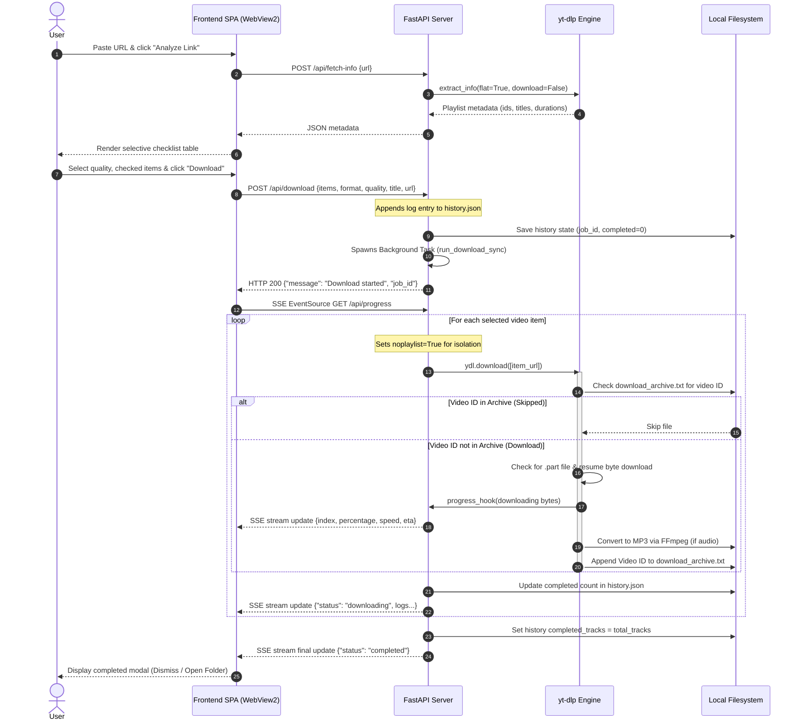

# SonicStream Architecture & Code Documentation

This document describes the system architecture, core components, data flows, and technical design of **SonicStream YouTube Downloader**.

---

## 1. High-Level System Architecture

SonicStream is designed as a **hybrid local desktop-web application**. It combines a lightweight Python-based ASGI backend with a modern single-page frontend, wrapped in a native Windows Edge WebView2 container.

```mermaid
graph TD
    subgraph Client Layer (Desktop App Window)
        A[SonicStream.bat Launcher] -->|Executes pythonw.exe| B[gui.py Wrapper]
        B -->|Spawns Native Window| C[WebView2 Engine]
        C -->|Renders SPA| D[index.html / style.css / app.js]
    end

    subgraph Service Layer (Local Server)
        B -->|Spawns Thread| E[FastAPI / Uvicorn Server]
        E <-->|API Endpoints / Server-Sent Events| D
    end

    subgraph Core Engine & OS Layer
        E -->|Executes| F[yt-dlp Engine]
        F -->|Converts Audio / Merges Tracks| G[FFmpeg CLI]
        E -->|Native os.startfile| H[Windows Explorer]
        E <-->|Persists Logs| I[(history.json)]
        F <-->|Tracks Completed IDs| J[(download_archive.txt)]
        F -->|Writes Media| K[downloads/ Folder]
    end
    
    style C fill:#2a1f3d,stroke:#9c27b0,stroke-width:2px,color:#fff
    style E fill:#0f2027,stroke:#00a8ff,stroke-width:2px,color:#fff
    style F fill:#1c2a38,stroke:#cbd5e1,stroke-width:2px,color:#fff
```

---

## 2. Process Sequence & Data Flow

When a user interacts with the application, data flows through the system to analyze, log, download, and report status. The sequence below details a standard playlist download:



---

## 3. Core Component Analysis

### A. Desktop Wrapper (`gui.py`)
To prevent port collisions, `gui.py` uses python's native `socket` library to bind to port `0`, which dynamically requests a free high-port from Windows.
* Starts FastAPI in a daemon thread.
* Mounts `pywebview` window to target `http://127.0.0.1:{port}`.
* Sets layout bounds to `1120x820` with a minimum size of `800x600` for responsive margins.
* Exiting the webview window kills the main thread, automatically terminating the background uvicorn daemon thread.

### B. Download Resume Logic (`main.py`)
SonicStream achieves robust resume capabilities by combining three mechanisms:
1. **Archive Indexing**: By setting `'download_archive': 'download_archive.txt'`, `yt-dlp` logs the unique 11-character YouTube video ID of every successfully downloaded file. On consecutive runs, `yt-dlp` references this index to instantly skip files.
2. **Buffer Resuming**: By default, `yt-dlp` saves active downloads as `<filename>.<ext>.part`. If stopped, it reads the part file length on the next attempt and requests a byte range start matching the remaining length, skipping redownloads.
3. **Loop Isolation**: Adding `'noplaylist': True` to the backend ensures the application manages the loops rather than `yt-dlp`'s internal engine, allowing sequential updates to the UI progress bar.

### C. History Logging (`history.json`)
The application records jobs in a JSON array format. It reads and writes the array using thread-safe locking (`threading.Lock`), updating the records dynamically.
* **Fields**: `id` (timestamp-based), `title` (playlist or video title), `url`, `timestamp`, `total_tracks`, `completed_tracks`, `format`, and `quality`.
* When clicking "Re-analyze", the frontend loads the stored URL back into the input box to automatically query and fetch the latest playlist additions.

---

## 4. UI Design System (`style.css` & `index.html`)

The frontend utilizes pure CSS styling to construct a premium, desktop-grade layout:
* **Background Depth**: Custom `@keyframes` float two blurred gradient orbs (Neon Blue and Neon Purple) behind a glassmorphic dashboard container (`backdrop-filter: blur(12px)`).
* **WebView2 Forms Fix**: Since WebView2 blocks clicks on label elements when inputs are hidden via `display: none;`, the radio buttons are hidden via visual-only CSS dimensions:
  ```css
  position: absolute; opacity: 0; width: 0; height: 0; pointer-events: none;
  ```
* **Scrollbars**: Customized browser scrollbars using matching slate colors to look unified inside the wrapped wrapper.
